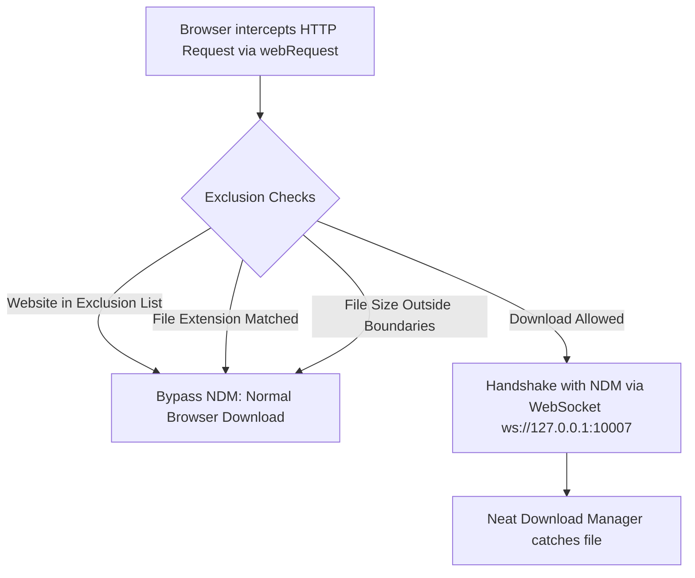

# Neat DL+ ⚡

[](https://developer.chrome.com/docs/extensions/mv3/intro/)
[](https://github.com/)
[](https://www.neatdownloadmanager.com/)
[](LICENSE)

**Neat DL+** is an enhanced, modern, and open-source Chrome Extension upgrade for **Neat Download Manager (NDM)**. 

While the original extension catches every download indiscriminately, **Neat DL+** gives you complete control over what gets intercepted: exclude specific websites, ignore certain file extensions, set file size thresholds (with clickable `KB`, `MB`, `GB` units), and back up your configuration to JSON.

---

## 🚀 Key Features

### 1. 🌐 Smart Website Exclusion
- **One-Click Quick Exclude**: Check "Exclude this site" directly in the popup or right-click anywhere on the page and select **"Exclude this site from Neat DL+"**.
- **Clean Domain Normalization**: Automatically extracts root hostnames and strips tracking query parameters (UTM tags, tokens, sub-paths) so rules apply reliably across the entire site.
- **Subdomain Coverage**: Automatically protects subdomains when parent domains are excluded.

### 2. 📁 File Type Exclusion Rules
- **Custom Extension Filters**: Define file extensions to ignore (e.g., `*.dat`, `*.tmp`, `*.iso`, `*.log`).
- **Flexible Syntax**: Accepts `dat`, `.dat`, or `*.dat` and normalizes them automatically.
- **Direct Browser Download**: Matched file types bypass NDM interception and download natively in Chrome without interruption.

### 3. ⚖️ File Size Limits (Catcher Thresholds)
- **Minimum Size Filter**: Ignore downloads smaller than $X$ (e.g., icons, small preview clips, thumbnails).
- **Maximum Size Filter**: Ignore downloads larger than $Y$ (let browser handle heavy files if preferred).
- **Clickable Unit Selector**: Easily switch between **`KB`**, **`MB`**, and **`GB`** with responsive segmented buttons.
- **Live Status Indicator**: Real-time summary showing active threshold bounds (e.g., *Catching files between 10 MB and 1 GB*).

### 4. 💾 Backup & Restore (JSON Config)
- **Export Settings**: Download a formatted `neat-dl-plus-config.json` containing all your excluded sites, file formats, and size limits.
- **Import Settings**: Restore your configuration with one click after reinstalling your browser or setting up a new computer.
- **Automatic Deduplication & Validation**: Sanitizes data upon import to prevent corrupt rules or duplicates.

### 5. 🎨 Modern & Clean User Interface
- **Minimalist Aesthetic**: Compact popup with iOS-style toggle switches and responsive controls.
- **Dark / Light Mode**: Built-in dynamic theme detection respecting `prefers-color-scheme`.
- **System Font Stack**: Native look-and-feel across macOS (SF Pro) and Windows (Segoe UI).
- **English Interface**: Unified, clean English typography throughout popup, context menus, and options pages.

### 6. 🛡️ Back/Forward Cache (Bfcache) Hardened
- Safe message channel teardown prevents `Unchecked runtime.lastError: The page keeping the extension port is moved into back/forward cache` console warnings in Chrome.

---

## 📂 Project Structure

```
NeatDLPlus/
├── manifest.json       # Manifest V3 configuration
├── bg.js               # Background service worker (Exclusion engine & NDM WebSocket)
├── ct.js               # Content script (Media detector & floating download panel)
├── popup.html          # Action popup interface
├── popup.css           # Popup styles (Dark/Light mode)
├── popup.js            # Popup logic & quick toggle actions
├── options.html        # Settings dashboard
├── options.css         # Options dashboard styles
├── options.js          # Settings state, live sync & JSON export/import
└── img/                # Extension icons (16px, 48px, 128px)
```

---

## 📥 Installation Guide

> **Prerequisite**: Ensure [Neat Download Manager](https://www.neatdownloadmanager.com/) desktop application is installed and running on your macOS or Windows system.

### Step-by-Step Setup:

1. **Download or Clone the Repository**:
   ```bash
   git clone https://github.com/your-username/NeatDownloader.git
   ```
   *(Or download and extract the ZIP file).*

2. **Open Your Chromium Browser's Extension Manager**:
   - **Google Chrome**: Go to `chrome://extensions/`
   - **Microsoft Edge**: Go to `edge://extensions/`
   - **Brave**: Go to `brave://extensions/`
   - **Opera / Vivaldi**: Go to their respective extensions settings page.

3. **Enable Developer Mode**:
   - Turn on the **Developer mode** toggle in the top-right corner of the extensions page.

4. **Load the Extension**:
   - Click the **Load unpacked** button (top-left).
   - In the folder picker, select the **`NeatDLPlus`** directory (the folder containing `manifest.json`).

5. **Verify & Pin**:
   - **Neat DL+** will appear in your extensions list.
   - Click the **Puzzle Icon (Extensions)** on your browser toolbar and pin **Neat DL+** for quick access.

---

## 🛠️ Usage & Tips

| Action | How-To |
| :--- | :--- |
| **Toggle Download Catcher** | Click the toolbar icon → flip the **Download Catcher** switch. Badge displays `Off` when disabled. |
| **Exclude Current Page** | Click the toolbar icon → check **Exclude this site**, or right-click any page and choose **"Exclude this site from Neat DL+"**. |
| **Exclude File Formats** | Click **Open Settings** → Navigate to **File Types** → enter format (e.g. `*.dat`) → click **Add**. |
| **Set Size Limits** | Click **Open Settings** → Navigate to **Size Limits** → enable Min/Max toggles, enter values, and click **KB / MB / GB**. |
| **Backup Configuration** | Click **Open Settings** → Navigate to **Backup & Restore** → click **Export JSON**. |
| **Restore Configuration** | Click **Open Settings** → Navigate to **Backup & Restore** → click **Import JSON** → pick your backup file. |

---

## ⚙️ How It Works (Technical Overview)



1. **`webRequest.onHeadersReceived`**: Inspects response headers (`Content-Type`, `Content-Disposition`, and `Content-Length`).
2. **Exclusion Check**: Evaluates origin domain against `excludedWebsites`, filename extension against `excludedFileTypes`, and file size against `sizeLimits`.
3. **Selective Interception**:
   - If excluded: Does not register the request ID; Chrome handles the download natively.
   - If eligible: Sends download metadata (`URL`, `Cookies`, `Headers`, `Referer`) through local WebSocket to `ws://127.0.0.1:10007/download`.

---

## 🔒 Privacy & Permissions

- **100% Local**: Neat DL+ does not collect telemetry, track browsing behavior, or send data to any external cloud server.
- **Local Sync**: Settings are saved locally using `chrome.storage.sync` (automatically synced across your signed-in browser instances via Google Chrome sync).
- **Open Source**: All background and content scripts are fully readable and inspectable.

---

## 📄 License

This project is open-source and available under the [MIT License](LICENSE).
Neat Download Manager is a trademark of its respective owner.
